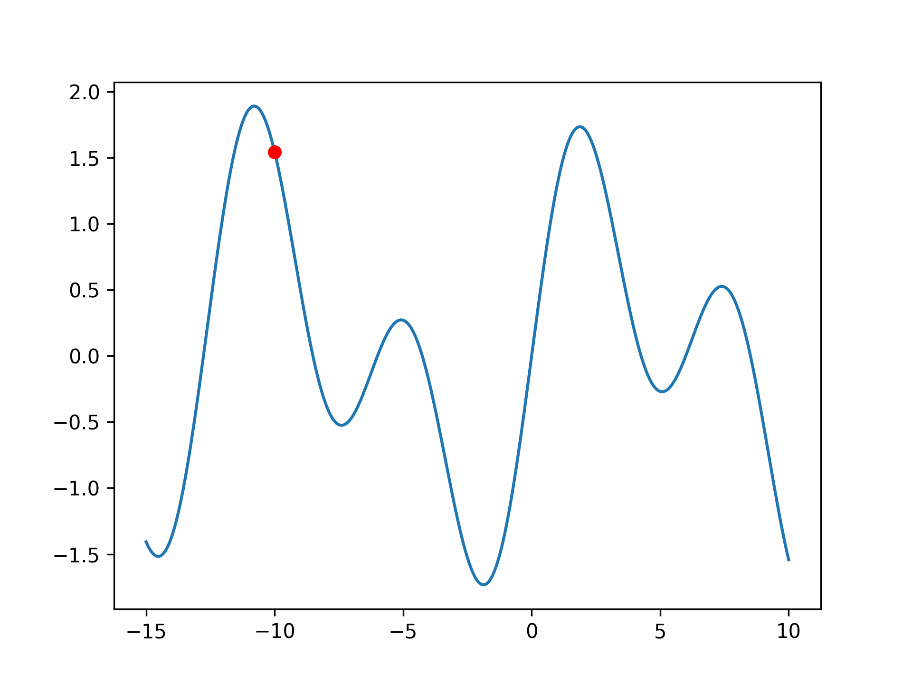

# Practice
This repository includes code that helps me understand/visualize crucial concepts in different fields.

# Gradient descent
I implemented the gradient descent algorithm from scartch with and without momentum. The difference between them was visualized in animations, such as:
